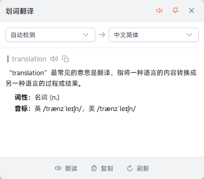
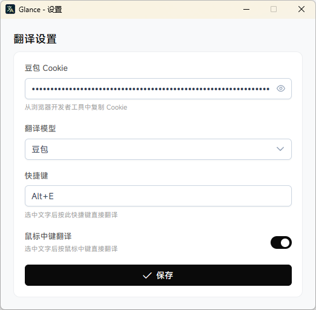

# Glance - 划词翻译助手

一个轻量的 Windows 划词翻译工具，选中文字按快捷键（或鼠标中键）就能翻译，翻译结果直接显示在鼠标旁边的小弹窗里。

内置 AI 翻译 API，支持流式输出，翻译过程几乎没有等待感。还集成了 TTS 语音合成，可以朗读原文和译文。


## 功能

- **划词翻译** — 选中文字后按快捷键（默认 `Alt+E`），翻译弹窗自动出现在鼠标附近
- **鼠标中键翻译** — 开启后选中文字按鼠标中键即可翻译，省去快捷键的步骤
- **流式翻译** — 翻译结果逐字输出，不用干等
- **语音朗读** — 内置 TTS 语音合成，支持朗读原文和译文
- **自动朗读** — 可选开启，划词后自动朗读原文
- **多语言** — 支持中、英、日、韩、法、德、西、俄等 15 种语言互译
- **多翻译引擎** — 支持在多个翻译服务之间切换
- **窗口置顶** — 翻译弹窗支持 Pin 住，不会因为切换窗口而消失
- **系统托盘** — 常驻托盘，不占任务栏位置
- **Markdown 渲染** — 翻译结果支持 Markdown 格式展示

## 技术栈

- [Tauri 2](https://v2.tauri.app/) — Rust 后端 + 系统级能力
- [Vue 3](https://vuejs.org/) — 前端框架
- [PrimeVue 4](https://primevue.org/) — UI 组件库
- [Tailwind CSS 4](https://tailwindcss.com/) — 样式方案
- [Vite](https://vite.dev/) — 构建工具

## 开始使用

### 环境准备

1. 安装 [Node.js](https://nodejs.org/)（>= 18）
2. 安装 [Rust](https://www.rust-lang.org/tools/install)
3. 安装 Tauri 2 的系统依赖，参考 [Tauri 官方文档](https://v2.tauri.app/start/prerequisites/)

### 安装依赖

```bash
yarn install
```

### 开发模式

```bash
yarn dev
```

### 构建安装包

```bash
yarn build
```

构建产物在 `src-tauri/target/release/bundle/nsis/` 目录下，是一个 `.exe` 安装程序。

## 配置说明

首次启动后点击系统托盘图标打开设置页面：

1. **API Cookie** — 从浏览器登录翻译服务后，在开发者工具中复制 Cookie 填入
2. **翻译模型** — 可在多个内置翻译引擎之间切换
3. **快捷键** — 自定义划词翻译的触发快捷键，默认 `Alt+E`
4. **鼠标中键翻译** — 开关控制，开启后选中文字按鼠标中键即可触发翻译

## 项目结构

```
src/                    # 前端代码
├── App.vue             # 翻译弹窗主界面
├── SettingsApp.vue     # 设置页面
├── components/         # 公共组件
├── shared/             # 共享模块（API、组合式函数、i18n）
└── utils/              # 工具函数

src-tauri/src/          # Rust 后端
├── lib.rs              # 应用入口与命令注册
├── config.rs           # 配置读写
├── translate.rs        # 翻译请求定义
├── doubao.rs           # AI 翻译 API 对接（SSE 流式）
├── tts.rs              # TTS 语音合成（WebSocket）
├── selection.rs        # 划词检测与弹窗管理
├── shortcut.rs         # 全局快捷键
├── mouse_hook.rs       # 鼠标中键全局钩子
└── tray.rs             # 系统托盘
```

## 截图预览

|                翻译弹窗                |               设置页面                |
| :------------------------------------: | :-----------------------------------: |
|  |  |

## 已知限制

- 目前仅支持 Windows
- 翻译服务依赖 Cookie 鉴权，Cookie 有效期有限，过期后需要重新配置
- 鼠标中键翻译会拦截中键事件，开启后中键的原有功能（如浏览器自动滚动）会失效

## License

MIT
